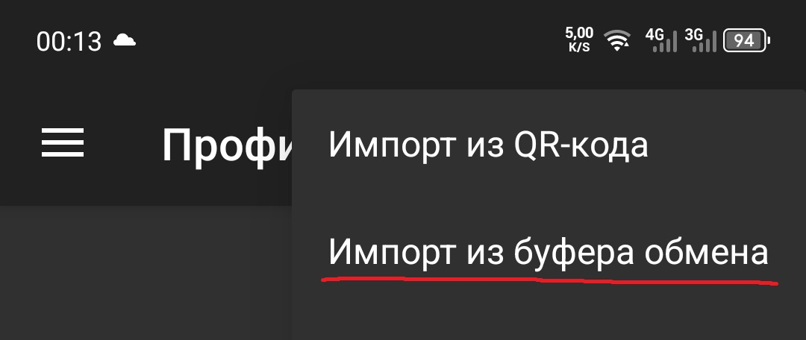
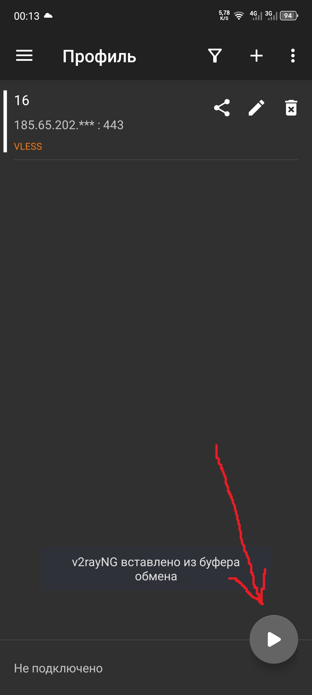

Android
=
Настройка через v2rayNG
-

1. Скачайте APK-файл с диска или таблицы ниже https://drive.google.com/drive/folders/13KY6cRNPo_p4VA6aagtKSjWwquumjuBk

    Название файла | Где используется
    |-|-|
    [v2rayNG_1.10.26_universal.apk](https://github.com/2dust/v2rayNG/releases/download/1.10.26/v2rayNG_1.10.26_universal.apk)     | Универсальная сборка (всё в одном) подойдёт для любого устройства, но весит больше
    [v2rayNG_1.10.26_arm64-v8a.apk](https://github.com/2dust/v2rayNG/releases/download/1.10.26/v2rayNG_1.10.26_arm64-v8a.apk)     | большинство современных Android‑телефонов (2018+), Snapdragon, MediaTek, Exynos
    [v2rayNG_1.10.26_armeabi-v7a.apk](https://github.com/2dust/v2rayNG/releases/download/1.10.26/v2rayNG_1.10.26_armeabi-v7a.apk)   | старые телефоны, Android 5–8, дешёвые модели
    [v2rayNG_1.10.26_x86.apk](https://github.com/2dust/v2rayNG/releases/download/1.10.26/v2rayNG_1.10.26_x86.apk)           | редкие планшеты, эмуляторы, Intel-устройства
    [v2rayNG_1.10.26_x86_64.apk](https://github.com/2dust/v2rayNG/releases/download/1.10.26/v2rayNG_1.10.26_x86_64.apk)           | эмуляторы Android (BlueStacks, LDPlayer и др.)

1. Установите скачанный файл при необходимости дайте разрешение Telegram или вашему браузеру на установку приложений

1. Скопировать ссылку на подключение `vless://534123-gdfg...`

1. В приложении добавьте конфиг через кнопку `+` 

1. Выберите `Импорт из буфера обмена` (если выдало ошибку повторите с 4 пункта) или `Импорт из QR-кода` для сканирования конфига 

1. Тапните по конфигу чтобы выбрать его, включайте подключение через кнопку внизу экрана

1. При необходимости разрешить доступ

1. Выключить подключение можно через ту же кнопку