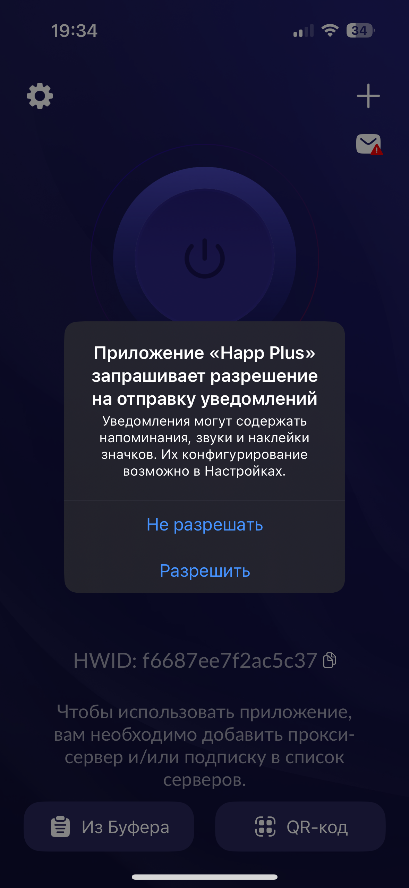
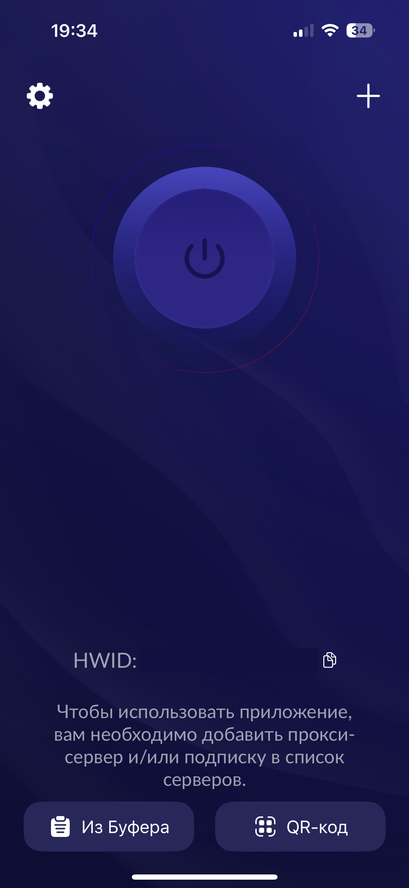
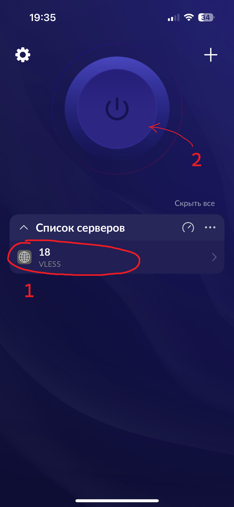

iOS & macOS
=
Настройка через Happ
-

1. Установите приложение с App Store [Global](https://apps.apple.com/us/app/happ-proxy-utility/id6504287215) [Rus](https://apps.apple.com/ru/app/happ-proxy-utility-plus/id6746188973)

1. Нажмите `Разрешить`

1. Скопируйте ссылку на подключение `vless://534123-gdfg...`

2. Нажмите `Из буфера` или `QR-код` для сканирования конфига 

1. `1.` Нажмите по конфигу чтобы выбрать его. `2.` Нажмите на кнопку по центру чтобы подключиться

1. При необходимости дайте разрешение

1. Отключить соединение можно той же кнопкой по центру